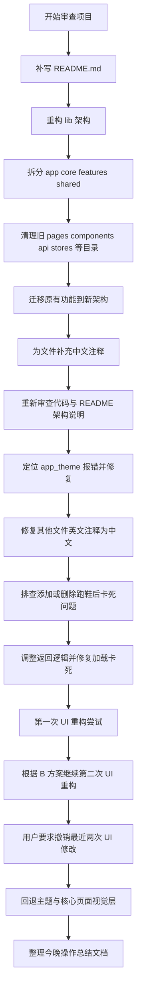

<!-- 今晚操作总结文档，记录本次会话内的主要开发动作与结果。 -->
# 今晚操作总结

## 1. 文档说明

本文档用于总结 2026-05-06 晚间围绕 `ShoeCloud` 项目进行的主要开发操作，便于后续继续开发、回顾变更范围和理解当前工程状态。

本次总结重点覆盖：

- 项目结构重构
- 旧文件清理与新架构迁移
- 注释与 README 整理
- 跑鞋添加/删除后的加载卡死问题修复
- UI 重构与后续撤销

---

## 2. 今晚操作总览

今晚的工作大致分成 6 个阶段：

1. 审查项目内容并补写 `README.md`
2. 按新架构拆分页面、组件、工具、模型和 API
3. 清理旧文件与重复文件，推动功能迁移到新架构
4. 将注释逐步改为中文，并补充文件职责说明
5. 修复添加或删除跑鞋后应用卡在加载界面的问题
6. 进行两轮 UI 重构尝试，随后按要求撤销最近两轮 UI 修改

---

## 3. 本晚完成的核心工作

### 3.1 项目架构重构

原项目的 `lib` 目录存在较明显的旧结构耦合，主要问题包括：

- `pages`、`components`、`api`、`stores`、`viewmodels` 等目录并行堆叠
- 页面层与业务逻辑、数据访问逻辑耦合较重
- 公共组件与业务组件边界不够清晰
- 路由、NFC、工具能力分散

针对这些问题，已将项目迁移为新的正式结构：

```text
lib/
├── app/
├── core/
├── features/
├── shared/
├── assets/
└── main.dart
```

新结构的职责划分如下：

- `app/`
  - 放置应用壳层、路由、主题、依赖装配
- `core/`
  - 放置基础设施能力，如网络、存储、NFC、常量
- `features/`
  - 按业务域拆分，如登录、首页、跑鞋、个人中心、隐私页、社区页
- `shared/`
  - 放置跨模块复用的通用组件和工具方法

### 3.2 旧文件与重复文件清理

已对旧架构目录做清理，主要包括：

- 清理旧的 `pages/`
- 清理旧的 `components/`
- 清理旧的 `api/`
- 清理旧的 `stores/`
- 清理旧的 `viewmodels/`
- 清理旧的 `routes/`
- 清理旧的 `nfc/`
- 清理旧的 `utils/`
- 清理旧的 `constants/`

说明：

- 这些旧文件大多已不再作为正式运行链路的一部分
- 当前运行主链路已迁移到新的模块化结构下
- 本次没有回滚这部分结构整理

### 3.3 README 与架构说明补充

已在 `lib` 目录下补写新的 README 文档，对以下内容做了系统说明：

- 项目简介
- 项目架构
- 已实现功能
- 未实现功能
- 现存缺点
- 可扩展改进方向
- 新项目的目录结构与文件职责

### 3.4 注释中文化

本晚对项目中的注释做了较大范围调整：

- 将大量英文注释改为中文
- 为新架构下的 Dart 文件补充了简要头部职责注释
- 注释风格从冗长说明改为“简洁职责型”

目标是让后续阅读代码时能更快理解文件定位与模块边界。

### 3.5 跑鞋添加/删除后卡死问题修复

这是今晚最关键的功能性修复之一。

#### 问题表现

当用户：

- 添加跑鞋后返回主界面
- 删除跑鞋后返回主界面

应用会卡在加载界面，必须退出并重进才能恢复。

#### 原因分析

问题核心在于：

- 原先操作完成后使用了较重的整页导航重建方式
- 页面返回链路与首页数据刷新链路之间存在状态不一致
- 首页的加载状态和栈内页面状态未能稳定恢复

#### 处理方式

在添加跑鞋页和编辑跑鞋页中，调整了成功后的返回逻辑：

- 不再简单使用整页重置方式回主页面
- 改为更稳妥地返回到既有页面栈
- 配合会话刷新与首页数据重载

#### 修复结果

当前保留的修复仍然有效：

- 添加跑鞋后不会再卡死在加载界面
- 删除跑鞋后不会再卡死在加载界面

---

## 4. UI 修改与撤销情况

### 4.1 已做的 UI 改动

今晚后半段曾围绕“B 方案”做过两轮 UI 重构，主要调整了：

- 全局主题
- 登录页
- 首页
- 跑鞋详情页
- 个人中心页
- 底部导航

改动方向包括：

- 莫兰迪色系
- 更强的卡片化布局
- 更接近参考图的视觉结构

### 4.2 本次已撤销的内容

根据最后要求，已撤销最近两轮 UI 界面重构，处理原则如下：

- 撤销最近两轮偏向 B 方案的视觉结构改动
- 保留今晚已完成的新架构重构
- 保留功能修复
- 保留中文注释和 README 整理

当前界面状态为：

- 不是 B 方案一比一版本
- 已恢复为更稳妥的正式绿色风格
- 保留新架构下的页面组织方式

### 4.3 当前保留的视觉层结果

当前仍保留的 UI 基础成果包括：

- 新主题体系仍然存在，但已回退为绿色正式版
- 公共卡片、按钮、空状态组件保留统一化设计
- 页面已继续运行在新架构下的页面文件中

---

## 5. 当前工程状态

截至今晚结束，项目处于以下状态：

### 5.1 已稳定保留

- 新架构目录拆分
- 旧结构文件清理
- 主业务功能迁移
- README 重写
- 中文注释整理
- 添加/删除跑鞋卡死问题修复

### 5.2 已撤销

- 最近两轮针对 B 方案的 UI 深度视觉重构

### 5.3 仍建议后续继续处理

- 对当前正式版 UI 做更克制的统一优化
- 做一次完整 `flutter analyze`
- 做一次真机或模拟器完整回归测试
- 对个别页面的布局细节继续修整

---

## 6. 今晚操作流程图

下面使用 Mermaid 流程图总结今晚操作的主线。



---

## 7. 关键结果总结

如果只看今晚最重要的结果，可以概括为：

- 项目已经从旧式堆叠结构迁移到较正式的模块化结构
- 旧文件与重复文件已大规模退出正式主链路
- README、注释、文件职责说明已明显完善
- 添加/删除跑鞋导致应用卡死的问题已修复并保留
- 最近两轮 B 方案视觉重构已按要求撤销

---

## 8. 后续建议

下一次继续开发时，建议优先做以下工作：

1. 对当前撤销后的正式版 UI 做小步统一优化，而不是再次整页大改
2. 运行完整分析与测试，确认新架构下没有遗漏问题
3. 补齐社区页、更多设置页等尚未正式实现的能力
4. 如后续还要做设计稿复现，建议先基于运行截图逐页比对，再落代码

